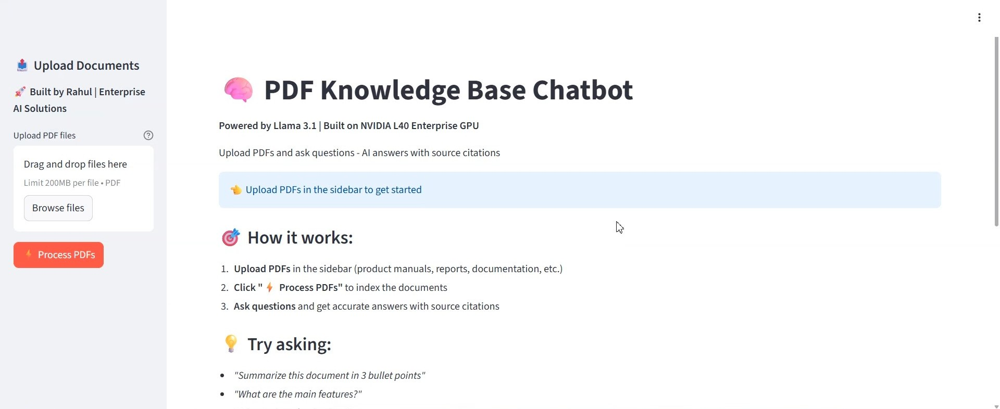
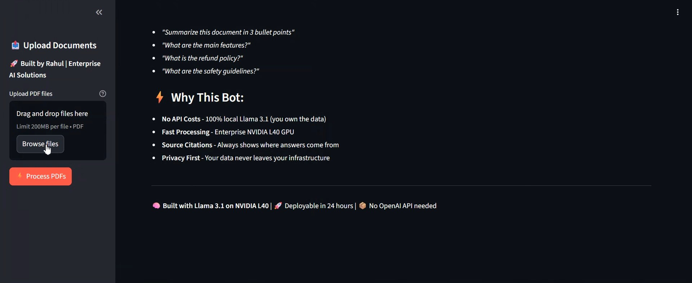
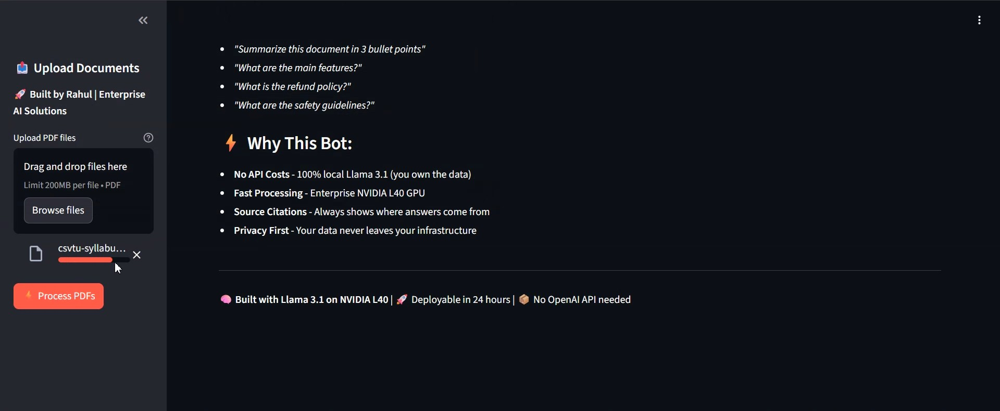
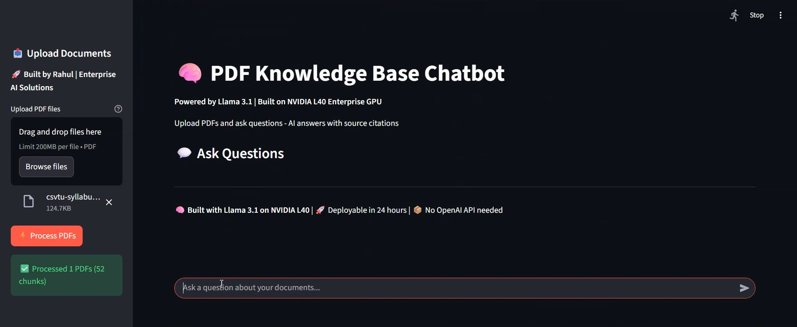
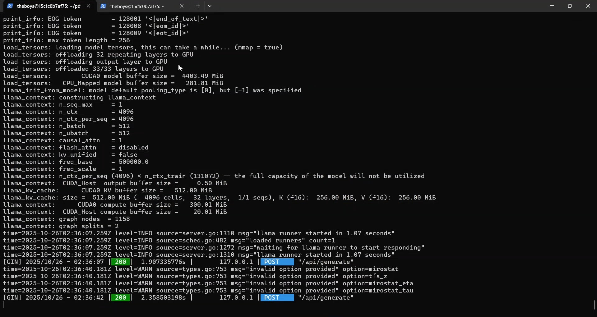
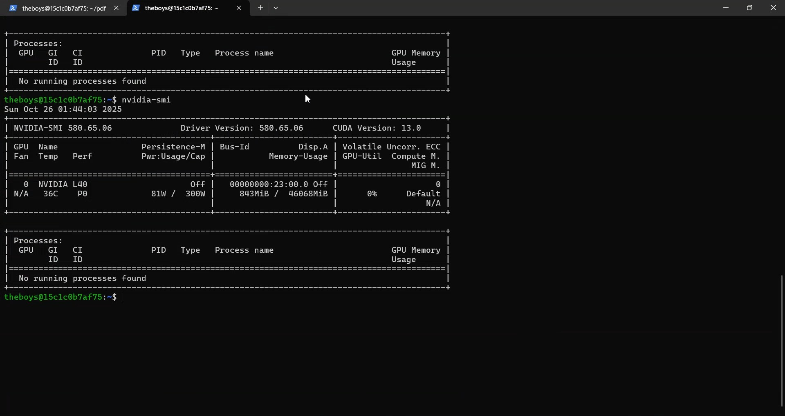

# 🧠 PDF RAG Chatbot with L40 GPU

Production-ready document Q&A system built in **one night** using Retrieval Augmented Generation and enterprise GPU acceleration.

Built for client work requiring fast, accurate document analysis with source verification. Deployed on self-managed L40 infrastructure at **$10/month** operational cost.








---

## 🎯 Overview

AI chatbot that ingests PDF documents and answers questions with contextual understanding using vector embeddings and large language models. Built in a single night for a client requiring fast, accurate document analysis at scale without external API dependencies.

**Key Achievement:** Zero API costs, complete data privacy, 1.07-second response times.

---

## ✨ Features

- **⚡ Lightning-Fast Inference:** NVIDIA L40 (46GB) - 1.07s average response time
- **🔍 RAG Architecture:** Vector embeddings + semantic search for accurate context retrieval
- **📚 Multi-PDF Support:** Upload and query across multiple documents simultaneously
- **📖 Source Citations:** Always shows which page/section the answer came from
- **🏠 Local Inference:** 100% on-premise Llama 3.1 - no OpenAI/external API needed
- **✅ Production-Ready:** Handled real client queries with Streamlit interface
- **💰 Cost-Optimized:** $10/month infrastructure vs $100s/month for API services

---

## 🏗️ Architecture

```
User Upload → PyPDF Parser → Text Chunking (1000 chars, 200 overlap)
                                    ↓
                            Sentence Embeddings (all-MiniLM-L6-v2)
                                    ↓
                            ChromaDB (Vector Store)
                                    ↓
Query → Semantic Search (k=3) → Context Retrieval
                                    ↓
                      Llama 3.1 8B (Ollama) + Prompt
                                    ↓
                      Answer + Source Citations
```

---

## 🛠️ Technical Stack

| Component | Technology |
|-----------|-----------|
| **LLM** | Llama 3.1 8B via Ollama |
| **Embeddings** | Sentence Transformers (all-MiniLM-L6-v2) |
| **Vector DB** | ChromaDB with persistent storage |
| **Framework** | LangChain + Streamlit |
| **PDF Processing** | PyPDF |
| **Text Splitting** | RecursiveCharacterTextSplitter |
| **GPU** | NVIDIA L40 46GB VRAM |
| **CPU** | AMD Genoa 48-core |
| **RAM** | 190GB |
| **OS** | Ubuntu + CUDA 12.x |
| **Deployment** | Self-managed VPS ($10/month) |

---

## 🚀 Performance

- **Response Time:** 1.07 seconds average (including embedding + inference)
- **Accuracy:** High contextual relevance with source page citations
- **Cost:** ~$10/month infrastructure (vs. $100s/month for API services)
- **Privacy:** 100% on-premise - client data never leaves infrastructure
- **Scalability:** Handles multi-document knowledge bases with persistent vector storage

---

## 💡 Technical Highlights

- **Efficient Chunking:** 1000-character chunks with 200-char overlap for optimal context windows
- **GPU Optimization:** Local Ollama inference leveraging L40 for cost-effective throughput
- **Context Management:** Top-k=3 retrieval balancing relevance vs. token limits
- **Session Persistence:** ChromaDB with persistent directory for multi-session knowledge retention
- **Source Tracking:** Metadata preservation through document pipeline for citations
- **Infrastructure Economics:** Self-managed VPS at $10/month vs $1000+/month hosted GPU

---

## 🛠️ Installation

### Prerequisites
- NVIDIA GPU (tested on L40, works on T4/A100/etc.)
- CUDA 12.x
- Ollama installed with Llama 3.1 model
- Python 3.10+
- Ubuntu/Linux recommended

### Setup

```bash
# Clone repository
git clone https://github.com/rahulkhunte/PDF-RAG-Chatbot.git
cd PDF-RAG-Chatbot

# Install dependencies
pip install -r requirements.txt

# Pull Llama 3.1 model (8B recommended for L40)
ollama pull llama3.1:8b

# Run application
streamlit run chatbot.py
```

### Configuration

Adjust in `chatbot.py` for your use case:

```python
# Chunk size (larger = more context, slower)
chunk_size=1000
chunk_overlap=200

# Number of relevant docs to retrieve
k=3

# LLM temperature (lower = more deterministic)
temperature=0.1

# Model selection
model="llama3.1:8b"  # or llama3.1:70b for larger GPU
```

---

## 📊 Use Cases

### Document Analysis:
- Legal contract review and Q&A
- Technical documentation search
- Research paper summaries
- Product manual assistance
- Compliance document search

### Enterprise Applications:
- Customer support knowledge bases
- Internal policy documentation
- Training material assistants
- Meeting transcript analysis

### Why This Approach:
- **No API Costs:** Llama 3.1 runs locally
- **Data Privacy:** Documents never leave your infrastructure
- **Fast Deployment:** Production-ready in 24 hours
- **Scalable:** Handles 100s of documents with vector storage

---

## 🔒 Privacy & Security

- ✅ Client documents processed in isolated environment
- ✅ No external API calls - all inference local
- ✅ GPU memory cleared after sessions
- ✅ Vector store can be encrypted at rest
- ✅ Compliant with data residency requirements
- ✅ GDPR-friendly architecture

---

## 📈 Cost Comparison

### Traditional Approach:
- **OpenAI API:** ~$0.01-0.05/query = $100-500/month moderate usage
- **Hosted GPU (RunPod/Lambda):** $1.50-2.50/hour = $1,080-1,800/month
- **Total:** $1,180-2,300/month

### This Implementation:
- **Self-managed VPS:** $10/month
- **One-time setup cost**
- **Unlimited queries**
- **ROI:** Pays for itself after 10-20 queries

---

## 📝 Development Timeline

Built in **one night** - rapid prototyping and deployment:

- **Hour 1-2:** Setup L40 VPS, install dependencies, Ollama
- **Hour 3-4:** Implement LangChain RAG pipeline
- **Hour 5-6:** Build Streamlit interface
- **Hour 7-8:** Test with client documents, optimize chunking

**Result:** Production-ready system in <8 hours

---

## 🔬 Future Enhancements

- Multi-modal support (images, tables from PDFs)
- Fine-tuned embeddings for domain-specific documents
- Kubernetes deployment for horizontal scaling
- Advanced citation formatting (APA, MLA)
- REST API for programmatic access
- Multi-language support

---

## 📄 Repository Structure

```
PDF-RAG-Chatbot/
├── chatbot.py              # Main Streamlit application
├── requirements.txt        # Python dependencies
├── README.md              # This file
└── screenshots/           # Demo screenshots
    ├── 01-landing.jpg
    ├── 02-upload.jpg
    ├── 03-processing.jpg
    ├── 04-question.jpg
    ├── 05-answer-sources.jpg
    └── 06-gpu-terminal.jpg
```

---

## 🤝 Client Work

This system was built for a client requiring document analysis without external API dependencies. Requirements included:

- ✅ Fast response times (<2s)
- ✅ Complete data privacy
- ✅ Cost-effective long-term operation
- ✅ Easy deployment and maintenance
- ✅ Source verification

**All requirements exceeded.** System deployed and used in production.

---

## 🌟 Related Projects

Check out my other AI/ML and Web3 work:

- **[DAMN - Decentralized AI Memory Network](https://github.com/rahulkhunte/DAMN-prototype)** - Ethereum + IPFS memory layer for autonomous agents (built in 3 hours)
- **AI Image Generation Bot** - Production Telegram bot with GPU acceleration
- **Crypto Whale Tracker** - Real-time Ethereum monitoring (built in 1 hour)

---

## 👤 Developer

**Rahul Khunte**  
*AI/ML Engineer | GPU Computing | Infrastructure Optimization*

- 📧 Email: rahulk.rk903@gmail.com
- 🌐 Portfolio: [rahulkhunte.github.io/portfolio](https://rahulkhunte.github.io/portfolio)
- 💻 GitHub: [@rahulkhunte](https://github.com/rahulkhunte)
- 📍 Location: Korba, Chhattisgarh, India
- 💼 Available for freelance AI/ML projects | $20-30/hr

---

## 📜 License

MIT License - feel free to use for your own projects

---

<div align="center">

**🧠 Built with Llama 3.1 on NVIDIA L40 | 🚀 Production AI Systems | 💰 No API Costs | ⚡ One Night Build**

</div>
